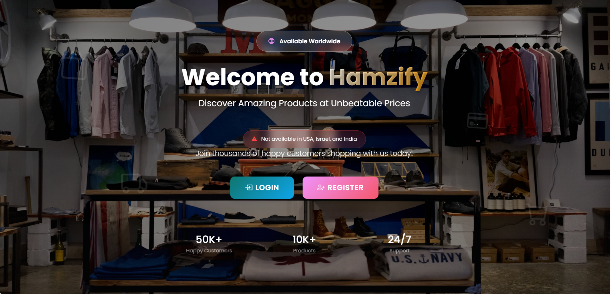

# Hamzify - Ecommerce Store

A Django-based ecommerce web application with product catalog, cart, wishlist, profile, orders, and payment flow.


## UI Preview


## Tech Stack
- Python 3.10+
- Django 5.x
- SQLite (default)
- HTML, CSS, JavaScript

## Features
- Product listing and detail pages
- Add to cart and cart management
- Wishlist support
- User account authentication
- Profile page
- Orders module
- Payment module
- Quick view modal endpoint
- Search and category pages

## Project Structure
- `accounts/` - auth and account-related logic
- `store/` - products, listing, detail, wishlist, search
- `cart/` - cart operations and APIs
- `orders/` - order workflows
- `payments/` - payment workflows
- `templates/` - frontend templates
- `media/` - product media assets

## Setup
```bash
python -m venv .venv
# Windows
.venv\\Scripts\\activate
# macOS/Linux
source .venv/bin/activate

pip install django
python manage.py migrate
python manage.py runserver
```

Open in browser:
- `http://127.0.0.1:8000/`

## Optional Commands
Seed/fetch commands are available under `store/management/commands/` (for example image fetching scripts) when required environment variables are configured.

## Notes
- `db.sqlite3` is included for local development.
- Keep secrets (API keys) in environment variables, not in source code.

## License
This project is for educational/development use.
